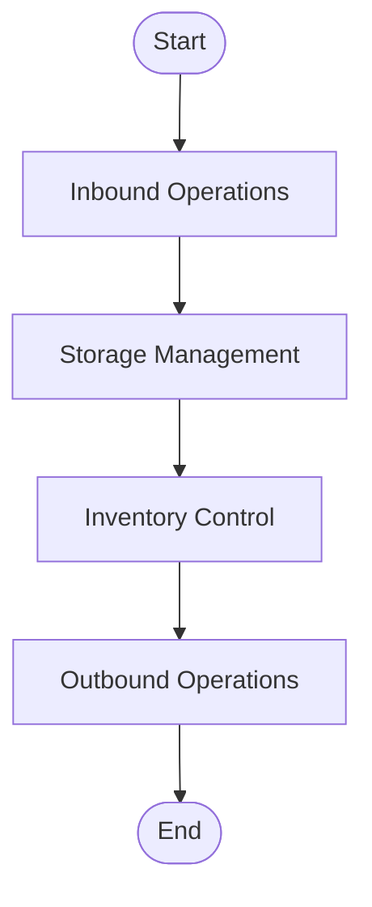
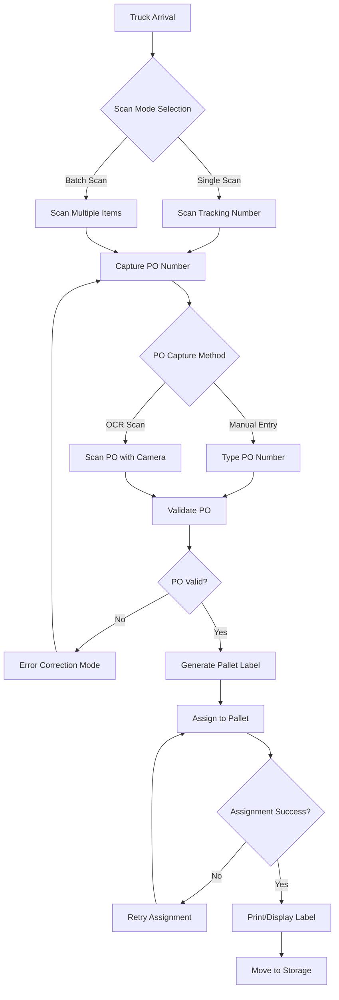
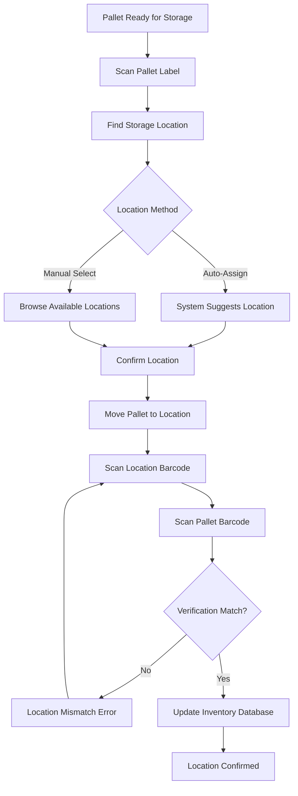
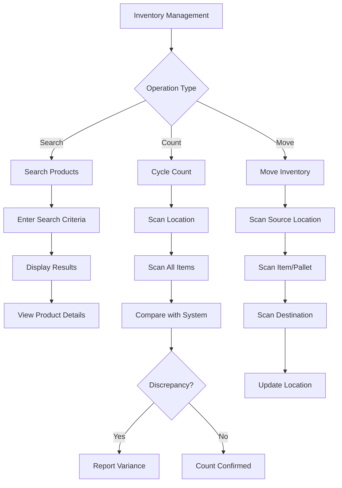
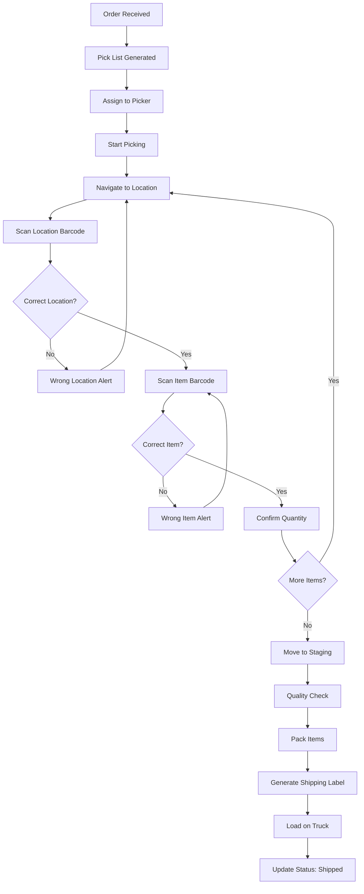
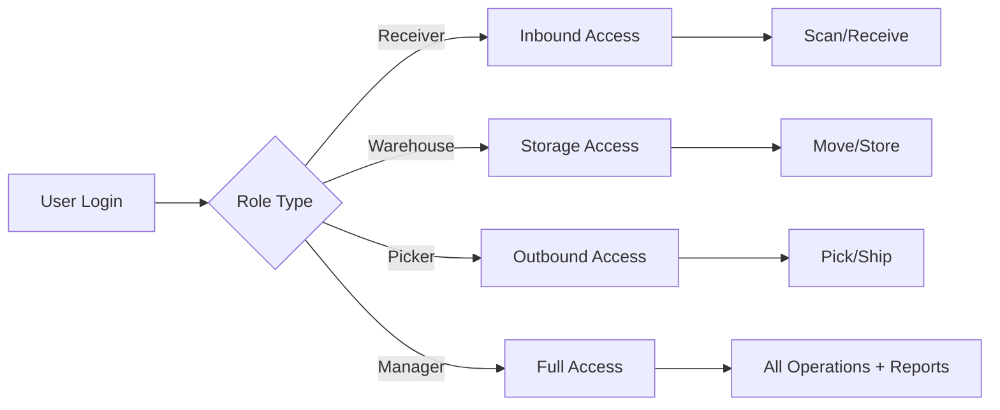
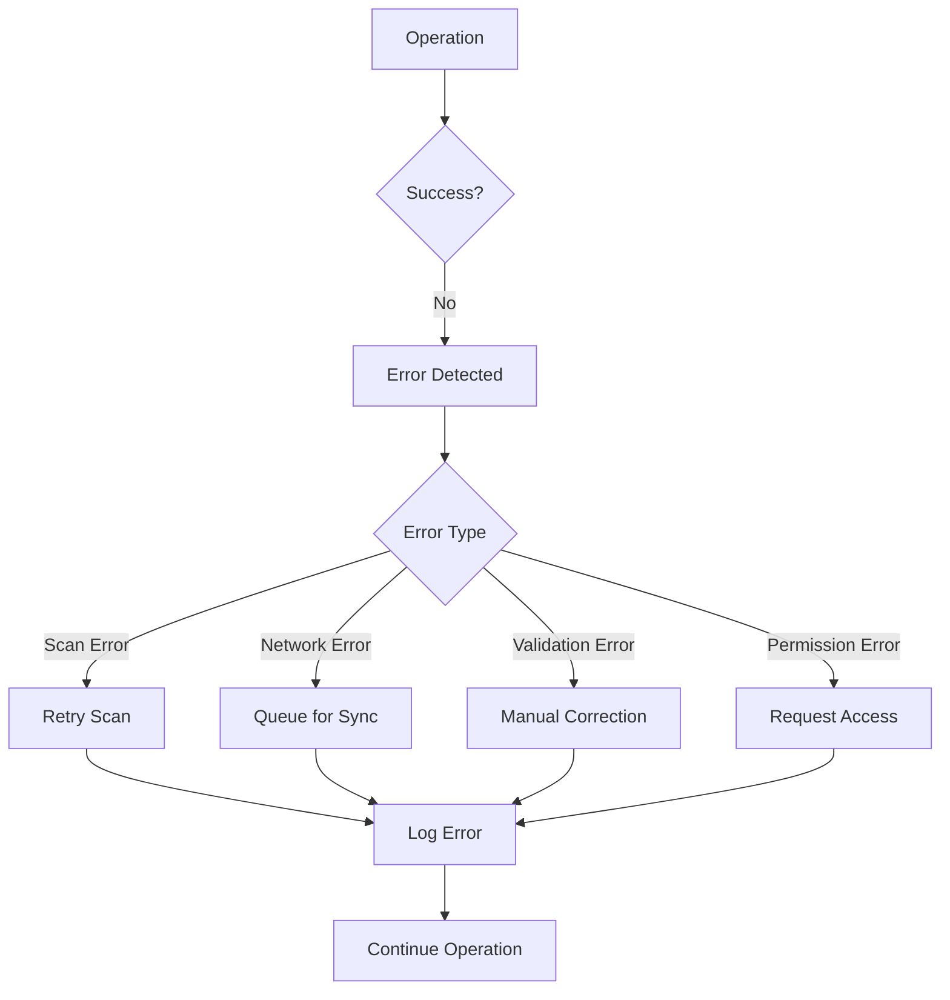
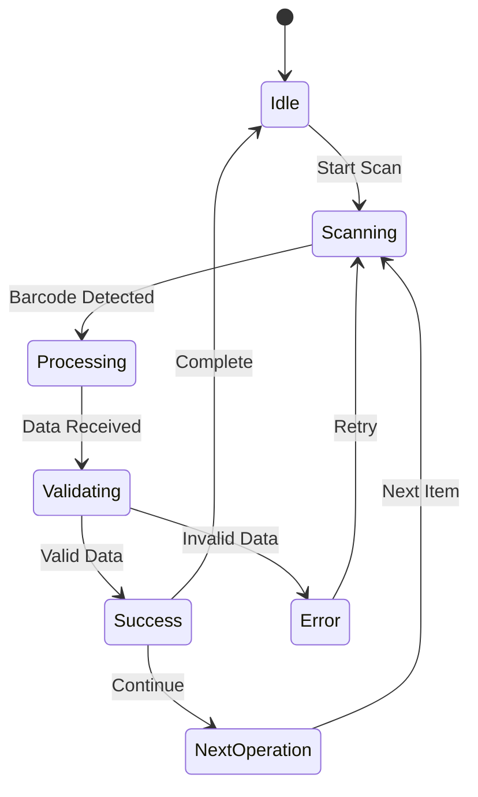
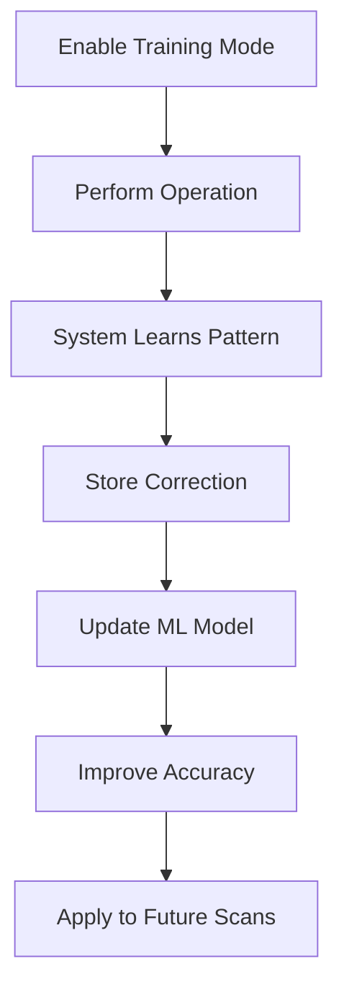

# Warehouse Management System - Complete Workflow

## System Overview

## Detailed Workflow - Inbound to Outbound

### 1. INBOUND OPERATIONS

### 2. STORAGE MANAGEMENT

### 3. INVENTORY CONTROL

### 4. OUTBOUND OPERATIONS

## Key Features & Functions

### Scanning Capabilities
- **Single Scan**: One tracking number at a time
- **Batch Scan**: Multiple items simultaneously
- **OCR Scan**: Automatic PO number extraction
- **Error Correction**: Manual override for scan failures

### Data Management
- **API Integration**: Ready for database connection
- **Real-time Updates**: Instant inventory synchronization
- **Training Mode**: Learn from corrections
- **Offline Mode**: Queue operations when disconnected

### User Roles & Permissions

## Error Handling Flow

## API Integration Points

1. **Inbound APIs**
   - POST /api/pallets/create
   - POST /api/items/receive
   - PUT /api/po/validate

2. **Storage APIs**
   - GET /api/locations/available
   - PUT /api/pallets/move
   - POST /api/inventory/update

3. **Search APIs**
   - GET /api/products/search
   - GET /api/pallets/find
   - GET /api/inventory/status

4. **Outbound APIs**
   - GET /api/orders/pick-list
   - PUT /api/orders/status
   - POST /api/shipments/create

## Performance Metrics

- **Scan Success Rate**: Track successful vs failed scans
- **Processing Time**: Measure time per operation
- **Error Rate**: Monitor correction frequency
- **Throughput**: Items processed per hour
- **Accuracy**: Picking/shipping accuracy percentage

## System States

## Training Mode Workflow

## Conclusion

This warehouse management system provides a complete solution for tracking inventory from receiving (inbound) through storage and finally to shipping (outbound). The modular design allows for easy API integration while maintaining robust error handling and training capabilities for continuous improvement.